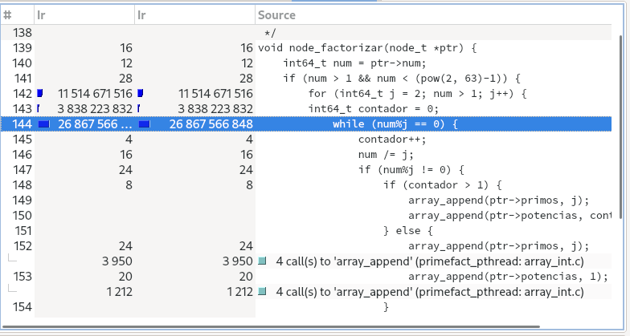
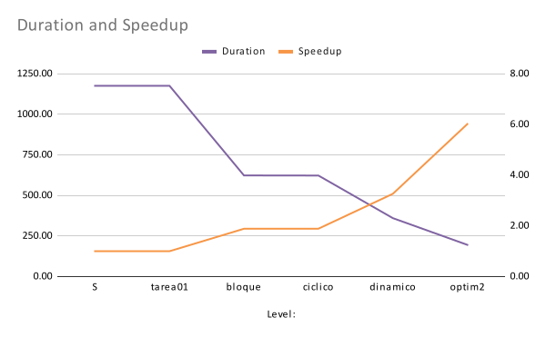
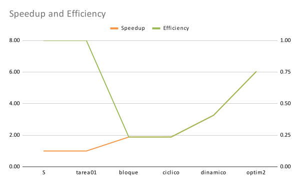
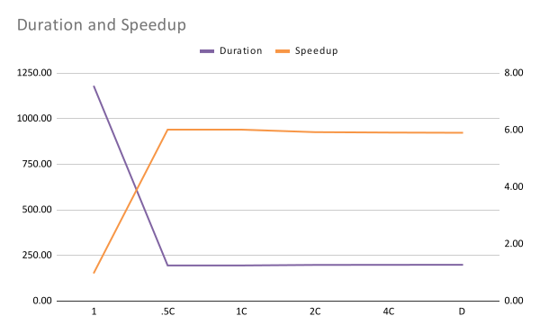
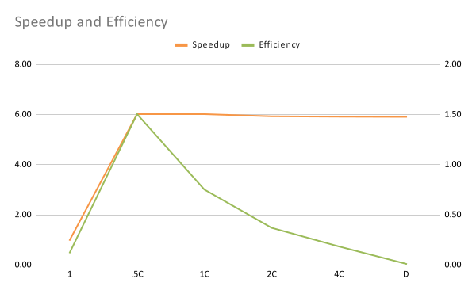

 # Reporte
_Para todos los valores en este reporte se tomó la menos de tres mediciones. Todas las mediciones se realizaron en una computadora con ocho CPUs_
### Optimización #1
Como ya se había realizado el mapeo dinámico en la tarea 2, se optó por realizar un mapeo por bloque y uno cíclico. Esto con el fin de poder comparar el incremento en desempeño que proporciona el mapeo dinámico realizado en la tarea 1. Por esta razón se tomaron como punto de inicio las mediciones del programa en su versión serial. 
A continuación las mediciones de estos tres mapeos:
|   |Serial|Bloque|Cíclico|Dinámico|
|:-:|:-:|:-:|---|---|
|Duración|1176.22|623.49|622.84|360.12|
|Speedup|1.00|1.89|1.89|3.27|
|Eficiencia|1.00|0.24|0.24|0.41|

Al ser el punto de partida el programa serial vemos que este tiene un speedup y una eficiencia de 1.00. El mapeo cíclico y el mapeo por bloque tuvieron resultados muy similares, por lo tanto no hay incremento ni de eficiencia ni desempeño. Sin embargo, como era de esperar el mapeo dinámico presenta una duración de casi la mitad con respecto a los otros dos mapeos.

### Optimización #2
Partiendo del mapeo dinámico de la parte anterior se realizó el proceso de profiling. Por medio de las herramientas de callgrind y kcachegrind se pudieron visualizar las areas de mayor consumo: 

Como se puede ver el método que más consume es el método de factorización por lo tanto se puso un enfásis en mejorar el rendimiento de este. 

Después de una investigación de como optimizar el método de factorización se ideo una solución que solo prueba los numeros impares y el 2, pues solo los numeros impares pueden ser primos. Con unos cuantos cambios a los ciclos del metodo para factorizar se consiguió un programa funcional y más rápido. 
A continuación las mediciones de la optmización realizada:
|   |Serial|Dinámico|Optimización|
|:-:|---|---|---|
|Duración|1176.22|360.12|195.45|
|Speedup|1.00|3.27|6.02|
|Eficiencia|1.00|0.41|0.75|

Con estos datos no queda duda de que la solución implementada es una mejora significativa sobre solamente el mapeo dinámico.

### Comparación de Optimizaciones

Viendo los gráficos de la optimizaciones se puede ver claramente que la duración decrementó con el mapeo dinámico y decrementó aún más con la segunda optimización. Resulta comprensible que el mapeo dinámico reduzca la duración pues también podemos ver que incrementó en eficiencia con respecto al mapeo de bloque y cíclico. El mapeo dinámico previene que uno de los threads se quede sin tareas mientras otro sigue trabajando. 

Así mismo con la segunda optimización decrementó significantemente la duración en comparación al mapeo dinámico. También podemos ver que la eficiencia y el speedup incrementaron con respecto al dinámico. Esto gracias a la optimización del algoritmo de factorización.

Podemos concluir con toda confianza que con el mapeo dinámico y la optimización del algoritmo de factorización se logró un programa mucho más optimizado comparado al serial, y además con una eficiencia sumamente alta de 0.75.

### Comparación Grado de Concurrencia

Leyendo la anteriores gráficas pordemos concluir que tanto la duración como el speedup llegan a su pico con la mitad de los threads y se mantienen relativamente constante conforme incrementa la cantidad de threads. Contrariamente la eficiencia también llega a su pico con la mitad de threads pero decrementa en picada después de eso, llegando hasta un 0.01 de eficiencia que es sumamente bajo. Se puede concluír facilmente que la solución optima es la mitad de los threads de la cantidad de CPUs que tiene la computadora.

[Mediciones y Gráficos.](https://docs.google.com/spreadsheets/d/1GMeu7UFKvPsHDeiW9xWEaw5hdhua3daVI-o19IAmArE/edit?usp=sharing)
