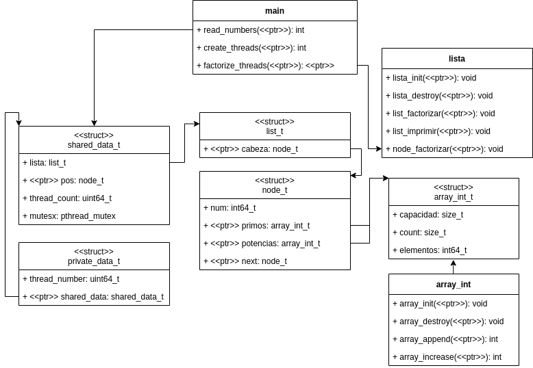

# Diseño

### Nodo
Los números que entran por la entrada estándar son almacenados en un nodo. Cada nodo contiene un puntero al próximo nodo para así poder recorrelos todos. Cada nodo almacena también dos arrays donde se van a almacenar las factorizaciones.
### Lista
La lista almacena unicamente un puntero al primer nodo, la cabeza. Es en esta clase que se realiza pueden recorrer los nodos para factorizar e imprimir.
### array_int
El array_int es un arreglo dinámico, almacena un arreglo normal pero con métodos para expandirlo.
### main
Desde la clase main se hace la creación de threads, cada uno de estos threads factoriza un número de manera paralela hasta que los números se acaben.
